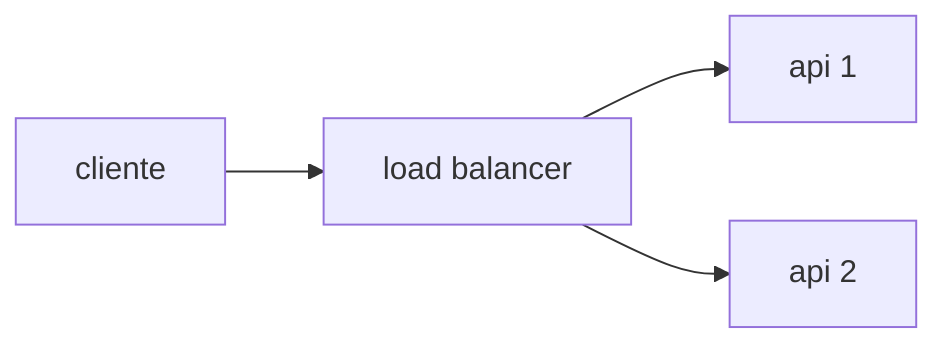

# rinha-de-backend-2026-andre-dotnet

Rinha backend 2026 .NET

## O desafio

Construir uma API de detecção de fraude em transações de cartão usando busca vetorial. Para cada transação recebida, transformar o payload em um vetor, buscar no dataset de referência as transações mais parecidas e decidir se aprova ou nega.

flowchart LR
Client[Cliente] -->|1. transação de cartão| Sistema[Sistema de Autorização<br/>de Cartão]
Sistema -->|2. consulta| Fraude[Módulo de<br/>Detecção de Fraude]
Fraude -->|3. decisão + score| Sistema
Sistema -->|4. aprovada/negada| Client

    classDef highlight fill:#4ade80,stroke:#15803d,stroke-width:3px,color:#000,font-weight:bold
    class Fraude highlight

Vamos implementar apenas o módulo em verde – o sistema de autorização do cartão não faz parte do desafio.

## O que a sua API deve expor

A sua API deve expor dois endpoints na porta 9999:

- GET /ready — deve responder 2xx quando sua API estiver pronta para receber requisições.
- POST /fraud-score — deve receber os dados da transação e devolver a sua decisão.

Exemplo de requisição e resposta:

```
POST /fraud-score

Request:
{
  "id": "tx-123",
  "transaction": { "amount": 384.88, "installments": 3, "requested_at": "..." },
  "customer":    { "avg_amount": 769.76, "tx_count_24h": 3, "known_merchants": [...] },
  "merchant":    { "id": "MERC-001", "mcc": "5912", "avg_amount": 298.95 },
  "terminal":    { "is_online": false, "card_present": true, "km_from_home": 13.7 },
  "last_transaction": { "timestamp": "...", "km_from_current": 18.8 }
}

Response:
{ "approved": false, "fraud_score": 0.8 }
```

### API

A sua API deve expor exatamente dois endpoints na porta 9999

#### Arquitetura e restrições

##### Topologia

A sua solução deve ter pelo menos **um load balancer e duas instâncias de API**. Você pode usar banco de dados, middleware, mais instâncias ou o que achar necessário. O essencial é ter um load balancer distribuindo carga de forma igual (round-robin simples) entre **pelo menos** duas instâncias de API.



**Importante**: o seu load balancer não pode aplicar lógica de negócio — ele não pode inspecionar o payload, decidir por condicionais, responder à requisição antes de repassá-la, nem transformar o corpo da mensagem. Ele só distribui requisições entre as instâncias.

##### Conteinerização

A sua solução deve ser entregue como um arquivo `docker-compose.yml`. Todas as imagens declaradas nele devem estar publicamente disponíveis.

A soma dos limites de recursos de todos os serviços declarados no `docker-compose.yml` deve ser de, no máximo, **1 CPU e 350 MB de memória**. Você distribui esse total entre os serviços como preferir. Exemplo de como declarar o limite de um serviço:

```yml
services:
  seu-servico:
    ...
    deploy:
      resources:
        limits:
          cpus: "0.15"
          memory: "42MB"
```

A entrega deve estar na branch `submission` do seu repositório, conforme [descrito aqui](./SUBMISSAO.md).

##### A porta 9999

A sua solução deve responder na porta **9999** — ou seja, o load balancer é quem recebe as requisições nessa porta.

##### Outras restrições

- As imagens devem ser compatíveis com `linux-amd64` (atenção especial para quem usa Mac com processadores ARM64 — [referência](https://docs.docker.com/build/building/multi-platform/)).
- O modo de rede deve ser `bridge`. O modo `host` não é permitido.
- O modo `privileged` não é permitido.

#### Rotas

##### `GET /ready`

Verificação de prontidão. A sua API deve responder com `HTTP 2xx` quando estiver pronta para receber requisições e ser testada.

##### `POST /fraud-score`

Este é o endpoint responsável pela detecção de fraudes. O formato do payload é como o seguinte exemplo:

```json
{
  "id": "tx-3576980410",
  "transaction": {
    "amount": 384.88,
    "installments": 3,
    "requested_at": "2026-03-11T20:23:35Z"
  },
  "customer": {
    "avg_amount": 769.76,
    "tx_count_24h": 3,
    "known_merchants": ["MERC-009", "MERC-001", "MERC-001"]
  },
  "merchant": {
    "id": "MERC-001",
    "mcc": "5912",
    "avg_amount": 298.95
  },
  "terminal": {
    "is_online": false,
    "card_present": true,
    "km_from_home": 13.7090520965
  },
  "last_transaction": {
    "timestamp": "2026-03-11T14:58:35Z",
    "km_from_current": 18.8626479774
  }
}
```

###### Campos da requisição

| Campo                              | Tipo             | Descrição                                                                          |
| ---------------------------------- | ---------------- | ---------------------------------------------------------------------------------- |
| `id`                               | string           | Identificador da transação (ex.: `tx-1329056812`)                                  |
| `transaction.amount`               | number           | Valor da transação                                                                 |
| `transaction.installments`         | integer          | Número de parcelas                                                                 |
| `transaction.requested_at`         | string ISO       | Timestamp UTC da requisição                                                        |
| `customer.avg_amount`              | number           | Média histórica de gasto do portador do cartão                                     |
| `customer.tx_count_24h`            | integer          | Quantidade de transações do portador nas últimas 24h                               |
| `customer.known_merchants`         | string[]         | Comerciantes já utilizados pelo portador                                           |
| `merchant.id`                      | string           | Identificador do comerciante                                                       |
| `merchant.mcc`                     | string           | MCC (Merchant Category Code), código da categoria do comerciante                   |
| `merchant.avg_amount`              | number           | Ticket médio do comerciante                                                        |
| `terminal.is_online`               | boolean          | Indica se a transação é online (`true`) ou presencial (`false`)                    |
| `terminal.card_present`            | boolean          | Indica se o cartão está presente no terminal                                       |
| `terminal.km_from_home`            | number           | Distância, em km, do endereço do portador                                          |
| `last_transaction`                 | object \| `null` | Dados da transação anterior (pode ser `null` quando não houver transação anterior) |
| `last_transaction.timestamp`       | string ISO       | Timestamp UTC da transação anterior                                                |
| `last_transaction.km_from_current` | number           | Distância, em km, entre a transação anterior e a atual                             |

###### Resposta

A sua API deve responder no formato deste exemplo:

```json
{
  "approved": false,
  "fraud_score": 1.0
}
```

Você pode consultar [vários exemplos de payloads aqui](/resources/example-payloads.json). O arquivo contém um array de payloads apenas para facilitar a leitura; no teste, cada requisição envia um payload individual.

---

##### Como decidir `approved` e `fraud_score`

A lógica de detecção (vetorização e busca vetorial) está descrita em:

- **[REGRAS_DE_DETECCAO.md](./REGRAS_DE_DETECCAO.md)** — especificação das 14 dimensões, da normalização e exemplos completos do fluxo.

- **[BUSCA_VETORIAL.md](./BUSCA_VETORIAL.md)** — explicação didática do conceito de busca vetorial.
